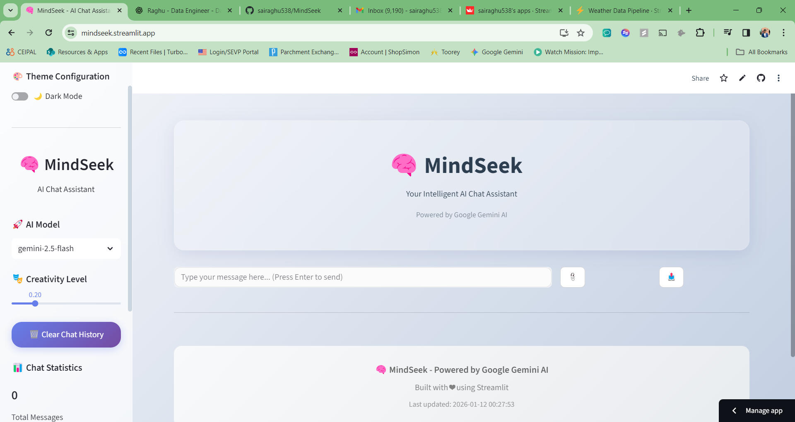
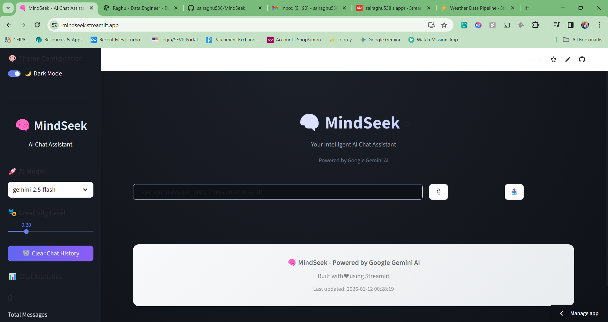
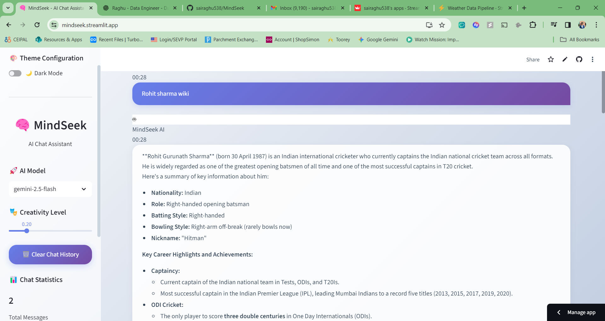
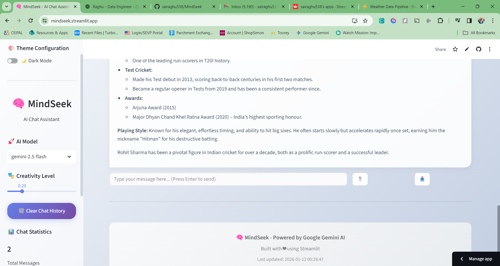

# 🧠 MindSeek - Intelligent AI Chat Assistant

[](https://mindseek.streamlit.app)


**MindSeek** is a next-generation AI chat application built with **Streamlit** and powered by Google's latest **Gemini 2.5 Flash** model. It features a stunning, responsive UI with a **Dual Theme System** (Glassmorphism Light & Neon Dark) and real-time streaming responses.

---

## ✨ Key Features

*   **🚀 Powered by Gemini 2.5**: Utilizes Google's fastest and most efficient model for instant, high-quality responses.
*   **🎨 Dual Theme System**:
    *   **☀️ Light Mode (Default)**: A clean, modern **Glassmorphism** aesthetic with soft gradients and frosted glass effects.
    *   **🌙 Premium Dark Mode**: A sleek, high-contrast **Neon Dark** theme for night-time usage and developer aesthetics.
*   **💬 Intelligent Conversation**: Maintains context-aware chat history for natural, flowing dialogue.
*   **⚡ Real-Time Streaming**: Experience instant feedback with token-by-token response streaming.
*   **🛠️ Developer Controls**: Adjust **Creativity (Temperature)** and switch models on the fly.
*   **📱 Fully Responsive**: Optimized for both desktop and mobile experiences.

---

## 📸 Screenshots

### ☀️ Light Mode (Glassmorphism)
*(Add your Light Mode screenshot here)*
![Light Mode Preview]


### 🌙 Dark Mode (Neon Variant)
*(Add your Dark Mode screenshot here)*


---


## 🛠️ Tech Stack

*   **Frontend**: Streamlit (Python)
*   **AI Backend**: Google GenAI SDK (`google-genai`)
*   **Model**: Gemini 2.5 Flash
*   **Styling**: Custom CSS3 with dynamic theme injection
*   **Deployment**: Streamlit Cloud

---

## 🚀 Quick Start

### Prerequisites
*   Python 3.8+
*   A Google Cloud Project with Gemini API access (Get a free key at [Google AI Studio](https://aistudio.google.com/))

### Installation

1.  **Clone the Repository**
    ```bash
    git clone https://github.com/sairaghu538/MindSeek.git
    cd MindSeek-1
    ```

2.  **Install Dependencies**
    ```bash
    pip install -r requirements.txt
    ```

3.  **Configure API Key**
    *   Create a `.env` file in the root directory.
    *   Add your Google API key:
        ```bash
        GOOGLE_API_KEY=AIzaSy...YourKeyHere
        ```

4.  **Run the App**
    ```bash
    streamlit run app.py
    ```

---

## 🌐 Deployment

This app is optimized for **Streamlit Cloud**.

1.  Push your code to GitHub.
2.  Login to [Streamlit Cloud](https://streamlit.io/cloud).
3.  Connect your repository.
4.  In the "Advanced Settings", add your secret:
    *   Key: `GOOGLE_API_KEY`
    *   Value: `Your_Actual_API_Key_String`
5.  Click **Deploy**!

---

## 🤝 Contributing

Contributions, issues, and feature requests are welcome! Feel free to check the [issues page](https://github.com/sairaghu/MindSeek/issues).

---

<p align="center">
  Made with ❤️ by Sairaghu using <b>Streamlit</b> and <b>Google Gemini</b>
</p>
